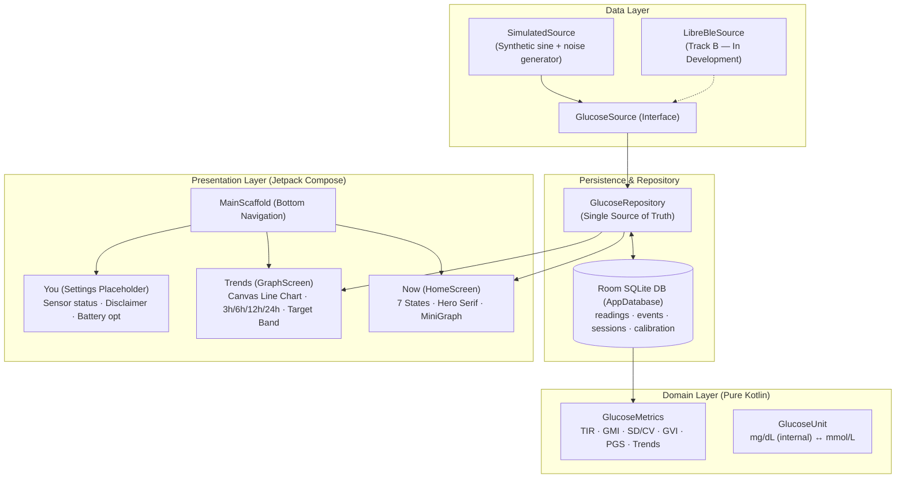

<div align="center">


# Sukoon (سكون)

**Still water for continuous glucose monitoring.**

A native Android continuous glucose monitoring (CGM) companion app for the FreeStyle Libre 2 (EU),<br/>
built as a calmer, less cluttered, open-source replacement for DiaBox.

-3E7A63?style=flat-square)
-2E5C4A?style=flat-square)

-82BBA0?style=flat-square)
_%C2%B7_Flows-3ecf8e?style=flat-square)
-3E7A63?style=flat-square)


[**Why Sukoon**](#-why-this-exists) · [**Two-Track Strategy**](#-strategy-two-parallel-tracks) · [**What is Built**](#-what-is-built-current-state-on-main) · [**Design System**](#-the-water-metaphor-state-signaling--design) · [**Architecture**](#%EF%B8%8F-how-it-works) · [**Safety & Privacy**](#-safety-privacy-and-trust) · [**Building**](#-building--getting-started) · [**Roadmap**](#%EF%B8%8F-roadmap)

<br/>

</div>

> [!IMPORTANT]
> **Not a medical device.** Sukoon is personal software in active development for educational, observational, and self-management research. Never make insulin dosing, medication, or clinical treatment decisions based on Sukoon readings alone — always verify with a finger-prick blood glucose meter. An in-app disclaimer gate must be reviewed and accepted on first launch before any readings are displayed.

---

## 🌊 Why this exists

Managing Type 1 or insulin-dependent diabetes requires checking glucose ~50 times a day, often while half-asleep, working, or driving. The current continuous glucose monitoring (CGM) app ecosystem is bifurcated:

1. **The official apps (FreeStyle LibreLink / Libre 3):** Visually sterile, clinical, and anxiety-inducing. Blaring, un-snoozable alarms that trigger alarm fatigue. Rigid cloud dependencies (LibreLinkUp frequently fails or is unavailable in Egypt and the wider MENA region even for EU-purchased sensors).
2. **The community apps (DiaBox, xDrip+, Juggluco):** Pioneered direct Bluetooth reading without manual scanning, but DiaBox is closed-source, protected by Baidu-Shell native obfuscation libraries (`libaescfb.so`, `libjniLibre.so`), visually cramped, prone to unexplained silent Bluetooth drops, and completely lacks an emergency escalation safety net.

**Sukoon (سكون — Arabic for calm, stillness, quietude) was built to solve both.** The name is the clinical brief: *stability is stillness*. Non-erratic, in-range glucose is the actual medical goal, not just a mood.

| | The Rule | What it means in practice |
| :-- | :-- | :-- |
| 🌊 | **Calm (سكون)** | No medical dread, no fluorescent red panic screens. Dual-encoded color + motion (calm sage teals for in-range, warm amber for high, coral red for low/urgent). Reassuring tone of voice. |
| 🩺 | **Direct BLE** | Designed to read the FreeStyle Libre 2 (EU) directly over continuous Bluetooth LE GATT streams without scanning. |
| 🛡️ | **Non-Negotiable Safety** | First-launch disclaimer gate, strictly bounded calibration caps (math mathematically prevented from masking a hypo), and a stale-data guard that greys out to `---` after 10 minutes of silence so no one boluses off an old number. |
| 🚨 | **Emergency Escalation** *(Roadmap)* | Unacknowledged urgent-low alarms trigger a 60-second full-screen countdown, then auto-send emergency SMS with GPS coordinates and auto-dial a primary emergency contact via `ACTION_CALL`. |
| 👥 | **Universal Sharing** *(Roadmap)* | Free real-time cloud sharing on Supabase (Postgres + Realtime + RLS). Family members and caretakers log in on their own phones (or future desktop widgets) to see a live companion dashboard with instant push alerts. |
| 🆓 | **$0 / Month** | 100% free stack. Runs locally, syncs on free-tier services, no subscription fees. |

---

## 🎯 Strategy: Two parallel tracks

To prevent UI and product iteration from stalling on sensor reverse-engineering, Sukoon decouples data consumption from hardware via a clean abstraction:

```kotlin
interface GlucoseSource {
    val readings: Flow<GlucoseReading>   // value, trend, timestamp, source
    val status: StateFlow<SourceStatus>  // connected / warming-up / stale / error
    suspend fun connect()
    suspend fun disconnect()
}
```

This separates development into two independent tracks:

- **Track A — Runnable app on `SimulatedSource` (Current `main` focus):**
  A complete, polished Android app running against synthetic or recorded glucose data. Navigation, Home states, Room persistence, interactive graphs, and clinical metrics are developed, tested, and demoed without waiting on physical sensor decoding.
- **Track B — Real Libre 2 EU Sensor Pipeline (In Active Development):**
  Deep, safety-critical reverse-engineering: NFC unlock (ISO 15693 NfcV) → encrypted BLE GATT stream → decryption (AES-CFB / XOR keystream) → factory calibration curve → glucose conversion.
  > [!WARNING]
  > **The Validation Loop (B7):** Track B code is not trusted by inspection alone. Clean-room key derivation and decryption can produce plausible-but-wrong numbers. Track B is gated on capturing live NFC/BLE packets from Kai's real sensor, decrypting them, and verifying that decoded mg/dL values track the official LibreLink app and finger-prick meter within clinical tolerance.

---

## ✨ What is built (Current state on `main`)

This section documents what is **currently merged into `main`** and verified by tests:

### 🏠 Home / Now: The calm hero screen
- ✅ **7 Distinct UI States:** The hero screen cleanly transitions across all clinical states via pure state mapping (`HomeUiStateMapper`):
  1. *In-Range:* Calm sage-teal background with steady status indicator (70–180 mg/dL).
  2. *Low:* Coral red banner with clear action prompts (<70 mg/dL).
  3. *Urgent Low:* High-priority alarm state (<54 mg/dL).
  4. *High:* Warm amber indicator (>180 mg/dL).
  5. *Warm-Up:* Sensor settling countdown.
  6. *Signal Lost / Stale:* Muted grey wash with `---` guard when readings are older than 10 minutes.
  7. *No Sensor Connected:* Clean onboarding prompt.
- ✅ **Glanceable Hero Typography:** Large serif current value (Newsreader) + 15-minute rate-of-change trend arrow (`↓↓`, `↓`, `→`, `↑`, `↑↑`) + delta change.
- ✅ **Mini 3-Hour Trend Bar:** Embedded historical preview widget (`MiniGraph.kt`) on Home.

### 🧭 Navigation & App Shell (A1)
- ✅ **3-Tab Compose Navigation:** Material 3 navigation shell (`MainScaffold.kt`) hosting **Now** (live glucose), **Trends** (graph & analytics), and **You** (settings & sensor).
- ✅ **State Preservation:** Tab switching preserves scroll and UI state across transitions via `popUpTo(saveState) / restoreState`.

### 💾 Persistence Pipeline (A2)
- ✅ **Room SQLite Database:** `AppDatabase` holding entities for `readings`, `events`, `sessions`, and `calibration`.
- ✅ **Reactive Repository:** `GlucoseRepository` continuously collects from the active `GlucoseSource`, validates rows, and persists readings to Room via an `AppContainer`-owned background collector.
- ✅ **Coroutines Flow:** UI components query Room directly using reactive Kotlin Flows — single source of truth without in-memory state drift.

### 📈 Interactive Graph Screen (A3)
- ✅ **Canvas-Drawn Line Chart:** Pure Jetpack Compose Canvas rendering (no third-party charting libraries).
- ✅ **Clinical Target Bands:** Shaded 70–180 mg/dL in-range band with dashed threshold reference lines.
- ✅ **Time-Range Toggles:** Interactive switching between **3h**, **6h**, **12h**, and **24h** history windows.
- ✅ **Tap-to-Inspect:** Tap anywhere along the curve to inspect the nearest reading value and exact timestamp.

### 🧮 Pure Kotlin Clinical Metrics Engine (Phase 0)
- ✅ **Deterministic, 100% unit-tested math:**
  - **Unit Conversion:** `1 mmol/L = 18 mg/dL` (internal representation is strictly mg/dL).
  - **Time in Range (TIR):** 5 clinical consensus brackets: `<54` (very low), `54–69` (low), `70–180` (in-range), `181–250` (high), `>250` (very high).
  - **GMI (%):** Glucose Management Indicator (estimated HbA1c) `= 3.31 + 0.02392 × meanGlucose`.
  - **Variability:** Standard Deviation (SD) and Coefficient of Variation (`CV% = SD / Mean × 100`, clinical target $\le 36\%$).
  - **GVI (Glycemic Variability Index):** Path length of the glucose curve divided by flat baseline length.
  - **PGS (Patient Glycemic Status):** Composite metric using piecewise sigmoids heavily weighting severe hypoglycemia.
  - **Trend Arrow:** Calculated from 15-minute rate-of-change (`mg/dL/min`).

### 📡 Libre 2 NFC ISO 15693 Framing (B0)
- ✅ **ISO 15693 Command Layer:** Low-level command framing, CRC-B calculation (reflected CRC-16/X-25 verified against catalog check value `0x906E`), `NfcV` session wrapper, block reads, and custom patch-info command `0xA1`. Key derivation interface defined.

### 🛡️ Safety & System Integration (Phase 0)
- ✅ **First-Launch Disclaimer Gate:** Mandatory tap-to-accept legal and medical safety gate (`DisclaimerGateScreen.kt`) before data access.
- ✅ **Battery Optimization Handling:** `BatteryOptimization.kt` prompts for `REQUEST_IGNORE_BATTERY_OPTIMIZATIONS` and guides users around OEM task killers (Xiaomi, Samsung, Huawei).

---

## 🌊 The Water Metaphor: State Signaling & Design

The design philosophy of Sukoon is **stillness, quiet, and reassurance**. State is communicated across two simultaneous sensory channels: **color** and **motion/texture**, ensuring complete accessibility for users with color vision deficiency.

<div align="center">
  
  <br/>
  <sub><b>The Crescent Cradle:</b> A crescent cut from overlapping circles cradling a point of light — stillness with a single ripple.</sub>
</div>

### 🎨 Color Palette & Visual Tokens

| State | Primary Hex | Palette Role | Meaning & Clinical Context |
| :--- | :--- | :--- | :--- |
| **In-Range** | `#3E7A63` / `#82BBA0` | **Sage Teal Family** | Stillness, calm waters. Glucose is safely within target (70–180 mg/dL). |
| **High** | `#C88A3E` | **Warm Amber** | Rising heat, dawn. Glucose above target (>180 mg/dL); requires attention, not panic. |
| **Low / Urgent** | `#C9564B` | **Coral Red** | Turbulence. Low (<70 mg/dL) and Urgent Low (<54 mg/dL). Differentiated by banner copy and alarm sound, not a second jarring hue. |
| **Canvas Light** | `#F4F1EA` | **Warm Paper** | High-legibility light theme background. |
| **Canvas Dark** | `#1E2B26` | **Deep Forest Ink** | Restful dark theme background. |

### 🪟 Home Screen States

| State | Visual Treatment | Hero Readout | Contextual Text |
| :--- | :--- | :--- | :--- |
| **In-Range** | Sage background tint, gentle water | Large serif number + trend arrow | "Within target range (70–180 mg/dL)." |
| **Low** | Coral red banner, action prompts | Number + bold downward arrow | "Glucose is low. Confirm with finger-prick." |
| **Urgent Low** | High-contrast red takeover | Bold number + alert indicator | "Urgent low glucose. Act immediately." |
| **High** | Warm amber accent | Number + upward arrow | "Glucose is above target." |
| **Warm-up** | Neutral sage with countdown ring | Countdown timer | "Sensor is warming up. First reading soon." |
| **Stale / Lost** | Muted grey wash, no colors | `---` with time indicator | "Signal lost. Checking connection..." |
| **No Sensor** | Clean empty state with pairing action | Muted placeholder | "No sensor connected. Pair a sensor to start." |

> [!NOTE]
> The full visual specification and bilingual UI exports live in [`_design-export/Sukoon Brand Directions.dc.html`](_design-export/Sukoon%20Brand%20Directions.dc.html) and [`Sukoon Motion Spec.dc.html`](_design-export/Sukoon%20Motion%20Spec.dc.html).

---

## ⚙️ How it works

### System Architecture (Current `main`)



---

### Tech Stack

| Layer | Choice | Rationale |
| :-- | :-- | :-- |
| **Language & Platform** | Kotlin 2.0.21, Android 8.0+ (API 26–35) | Native Android performance and background lifecycle management. |
| **UI Framework** | Jetpack Compose (Material 3) | Declarative UI with custom Canvas rendering for smooth graph inspection. |
| **Local Database** | Room 2.6.1 (SQLite) with Coroutines Flow | Reactive single source of truth; live UI updates without database polling. |
| **Architecture** | Repository pattern with manual DI (`AppContainer`) | Simple, transparent dependency wiring without heavy DI framework overhead. |
| **Clinical Metrics** | Pure Kotlin domain module | Deterministic math with 37 passing unit tests (100% success rate on `main`). |
| **Sensor Decryption** | Kotlin port of GlucoseDirect / DiaBLE / LibreTools (MIT) | 100% clean-room community lineage. Free of GPL obligations. |

---

## 🔒 Safety, Privacy, and Trust

### Non-Negotiable Safety Rules

1. **First-Launch Disclaimer Gate:** Tap-to-accept gate displayed before any reading can be viewed, reminding users that Sukoon is not an FDA-cleared medical device and finger-prick confirmations are mandatory before treatment.
2. **Stale-Data Guard:** If no fresh reading is received for >10 minutes, the hero value immediately greys out and displays `---`. Stale numbers are never shown as current to prevent dangerous insulin boluses based on outdated data.
3. **Capped Calibration (Track B Invariant):** When finger-prick calibration lands, adjustments will be strictly capped to `×0.8–1.25` slope and `±20 mg/dL` offset. Calibrations taken during rapid glycemic shifts are rejected, and a calibration can **never raise a reading below 70 mg/dL**.
4. **Cancellable Emergency Escalation (Roadmap):** The planned L4 emergency call feature will always provide a 60-second full-screen cancellable countdown window before dialing.

### Data Privacy & Local-First Philosophy

- **100% Local-First:** All glucose readings, events, and sensor sessions are stored in an on-device SQLite database.
- **Zero Telemetry:** Sukoon contains no analytics, tracking beacons, or third-party ad SDKs.
- **Cost:** **$0 / month** on 100% free open-source infrastructure.

---

## 📦 Building & Getting Started

### Prerequisites

- **Android Studio Ladybug (2024.2.1+)**
- **JDK 17** (configured as your Gradle JDK in Android Studio)
- **Android SDK:** `minSdk 26` (Android 8.0 Oreo), `compileSdk 35` (Android 15)

### Running in Android Studio

1. Clone the repository:
   ```bash
   git clone https://github.com/khairyKY/sukoon.git
   ```
2. Open the project folder in **Android Studio**.
3. Allow Gradle to sync dependencies from `gradle/libs.versions.toml`.
4. Select an Android Emulator (API 26+) or connected physical device.
5. Click **Run 'app'** (`Shift + F10`).

The app will launch in **Simulated Mode**, automatically cycling through realistic glucose trajectories so you can explore all 7 home states and interactive graphs immediately without hardware pairing.

### Running Tests

Execute the unit test suite inside Android Studio via the **Run** window, or via Gradle:

```bash
# In Android Studio Terminal / Command Line
./gradlew test
```

*Status on `main`: 37 passing unit tests (100% success rate).*

---

## 🏛️ Repository Layout (On `main`)

```
sukoon/
├─ app/
│  ├─ src/main/java/com/sukoon/app/
│  │  ├─ data/
│  │  │  ├─ db/             Room SQLite database (AppDatabase) & entities
│  │  │  │                  ReadingEntity · EventEntity · SensorSessionEntity · CalibrationEntity
│  │  │  ├─ prefs/          DisclaimerPrefs (first-run gate)
│  │  │  ├─ repository/     GlucoseRepository · ReadingMappers
│  │  │  └─ source/         GlucoseSource abstraction & SimulatedSource
│  │  │     └─ libre/       Iso15693 · LibreKeyDerivation (stub) · LibreNfcSession
│  │  ├─ domain/
│  │  │  ├─ metrics/        Pure Kotlin clinical metrics (TIR, GMI, SD/CV, GVI, PGS, trend arrows)
│  │  │  └─ units/          Unit conversion (mg/dL maintained internally)
│  │  ├─ platform/          BatteryOptimization (OEM killer guidance)
│  │  ├─ ui/
│  │  │  ├─ components/     MiniGraph · SukoonMark (Crescent Cradle)
│  │  │  ├─ graph/          GraphScreen · GraphViewModel (Canvas line chart)
│  │  │  ├─ home/           HomeScreen (all 7 states) · HomeViewModel · HomeUiStateMapper
│  │  │  ├─ navigation/     MainScaffold (3-tab Compose navigation)
│  │  │  ├─ onboarding/     DisclaimerGateScreen (mandatory first-run safety)
│  │  │  └─ theme/          Colors (Sage, Amber, Coral) · Theme · Type
│  │  ├─ di/AppContainer.kt Manual dependency container
│  │  ├─ MainActivity.kt    Activity entry point
│  │  └─ SukoonApp.kt       Application lifecycle
│  └─ src/test/java/        37 unit tests across metrics, crypto, and state mappers
├─ docs/
│  ├─ PLAN.md               Master technical & product roadmap
│  ├─ track-a-plan.md       Track A execution plan (UI on simulator)
│  ├─ track-b-plan.md       Track B execution plan (real Libre 2 sensor pipeline)
│  ├─ design-screens.md     Design inventory of all screens and states
│  └─ images/               Brand identity assets (sukoon-mark.svg)
└─ _design-export/          Pixel-perfect bilingual HTML design source (EN & Egyptian Arabic)
```

---

## 🗺️ Roadmap

The roadmap tracks both development tracks:

### Track A — Full App Delivery (UI & Features)

| Milestone | Scope & Deliverables | Status |
| :--- | :--- | :--- |
| **Phase 0** | `GlucoseSource` abstraction, Room schema, metrics module (TIR/GMI/CV/GVI/PGS), unit tests, disclaimer gate. | ✅ Merged on `main` |
| **A1** | Compose navigation shell (Now, Trends, You) with state preservation. | ✅ Merged on `main` |
| **A2** | Persistence pipeline (`GlucoseRepository` + Room SQLite + reactive Flows). | ✅ Merged on `main` |
| **A3** | Interactive Canvas glucose graph with 3h/6h/12h/24h toggles and target bands. | ✅ Merged on `main` |
| **A4** | Logbook: quick-entry sheet (meals, insulin, finger-pricks) + timeline. | 🌱 In active development |
| **A5** | Alerts engine: L1–L3 alarms, custom sounds, DND bypass for urgent lows. | 🌱 In active development |
| **A6** | Cloud sharing: Supabase backend (Auth, RLS, Realtime), companion follower viewer. | 🌱 In active development |
| **A7** | Onboarding: multi-step permissions, role selection, units setup. | 🌱 In active development |
| **A8** | Emergency escalation (L4): unacknowledged low countdown → auto-SMS + auto-call. | 🌱 In active development |
| **A9** | Insights & AGP: Ambulatory Glucose Profile percentiles + doctor-ready A4 PDF export. | 🌱 In active development |
| **A10** | Settings & calibration: finger-prick entry with safety caps + theme settings. | 🌱 In active development |
| **A11** | Glance home-screen widget: resizable Tiny, Strip, and Card layouts. | 🌱 In active development |
| **A12** | Localization sweep: complete English & Egyptian Arabic parity. | 🌱 In active development |

### Track B — Real Libre 2 EU Sensor Pipeline

| Milestone | Scope & Deliverables | Status |
| :--- | :--- | :--- |
| **B0** | ISO 15693 NFC command framing + CRC-B calculation. | ✅ Merged on `main` |
| **B1** | NFC read: hardware validation against real EU Libre 2 sensor. | ⬜ Awaiting sensor test |
| **B2** | Activation / BLE-streaming enable handshake via NFC. | ⬜ Awaiting sensor test |
| **B3** | Key derivation (UID + patch info → BLE streaming key & PIN). | ◐ Ported, awaiting B7 |
| **B4** | BLE GATT connection, auth PIN handshake, and notification subscription. | ⬜ Awaiting sensor test |
| **B5** | BLE stream decryption (XOR keystream / AES-CFB) + CRC-16 packet validation. | ⬜ Awaiting sensor test |
| **B6** | Raw counter & voltage to calibrated glucose (mg/dL) conversion. | ⬜ Awaiting sensor test |
| **B7** | **The Validation Loop:** Acceptance gate verifying decoded mg/dL tracks LibreLink. | ⬜ Awaiting sensor test |
| **B8** | Pluggable firmware-variant decoder architecture. | 🗓 Planned |
| **B9** | 24/7 background BLE reconnect watchdog & foreground service. | 🗓 Planned |
| **B10** | Calibration application with strict mathematical safety caps. | 🗓 Planned |
| **B11** | Full 14-day continuous hardware soak test on daily phone. | 🗓 Planned |

---

## 🙏 Standing on

Sukoon stands on the shoulders of the open-source diabetes community:

- **[GlucoseDirect](https://github.com/creepymonster/GlucoseDirectApp)** (MIT License): Reimar Metzen's pioneering app, whose Libre 2 decoding algorithms formed the basis for Sukoon's Kotlin BLE/NFC port.
- **[DiaBLE](https://github.com/gui-dos/DiaBLE)** (MIT License) by Guido Soranzio and **[LibreTools](https://github.com/ivalkou/LibreTools)** (MIT License) by Ivan Valkou for essential reverse-engineering research and testbenches. See [`THIRD_PARTY_NOTICES.md`](THIRD_PARTY_NOTICES.md).
- **[DiaBox](https://www.diaboxapp.com/)** and **[xDrip+](https://github.com/NightscoutFoundation/xDrip)** for demonstrating the transformative power of direct continuous BLE glucose streaming.
- **[OpenAPS](https://openaps.org/) & [Loop](https://loopkit.github.io/loopdocs/)** for publishing the exponential decay equations behind the Insulin on Board (IOB) tracking model.
- **Typefaces:** [Newsreader](https://fonts.google.com/specimen/Newsreader) (Production Type), [Hanken Grotesk](https://fonts.google.com/specimen/Hanken+Grotesk), [Amiri](https://fonts.google.com/specimen/Amiri) (Khaled Hosny), and [IBM Plex Sans Arabic](https://fonts.google.com/specimen/IBM+Plex+Sans+Arabic), licensed under the SIL Open Font License.

---

## ⚖️ License

Sukoon's original application code, UI, and domain engines are licensed for personal and transparent research use. FreeStyle Libre 2 decryption and NFC components are Kotlin ports of MIT-licensed community code (see [`THIRD_PARTY_NOTICES.md`](THIRD_PARTY_NOTICES.md)). GPL-licensed projects are strictly excluded to preserve full independent ownership.

<div align="center">
<br/>

<br/>
<sub><i>هدوء واستقرار، قراءة بقراءة</i></sub><br/>
<sub><i>stillness &amp; stability, one reading at a time</i></sub>
</div>
