<div align="center">


# Sukoon (سكون)

**A calm glucose app that talks straight to your Libre 2.**

A native Android app for the FreeStyle Libre 2 and 2 Plus (EU). It reads the sensor over Bluetooth with no reader app in between,<br/>
sounds alarms that actually reach you, texts and calls your family when a low goes unanswered, and costs $0 a month.


-2E5C4A?style=flat-square)


[**Why**](#-why-this-exists) · [**Tour**](#-a-tour) · [**Install**](#-install) · [**Features**](#-what-it-does) · [**Alarms**](#-alarms-that-reach-you) · [**How it works**](#%EF%B8%8F-how-it-works) · [**Privacy**](#-what-leaves-your-phone) · [**Troubleshooting**](#-troubleshooting) · [**Develop**](#%EF%B8%8F-development) · [**Roadmap**](#%EF%B8%8F-roadmap)

<br/>

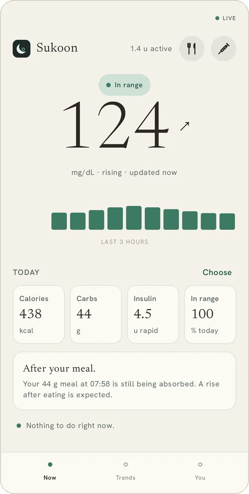
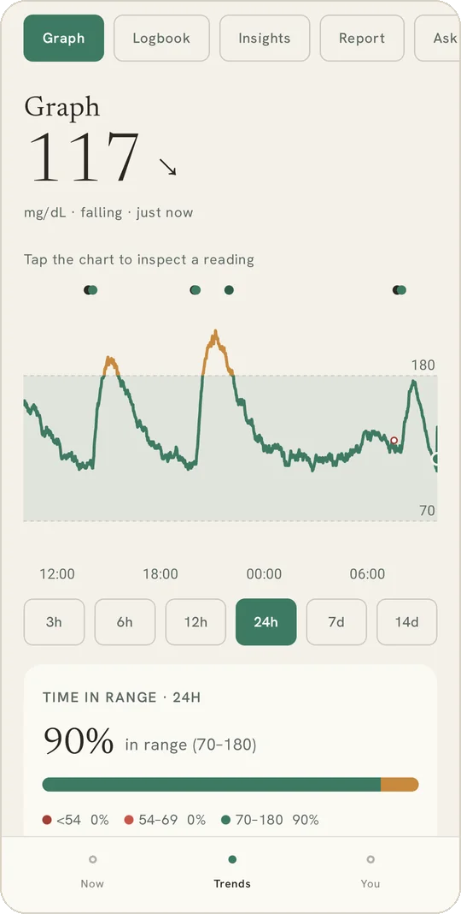
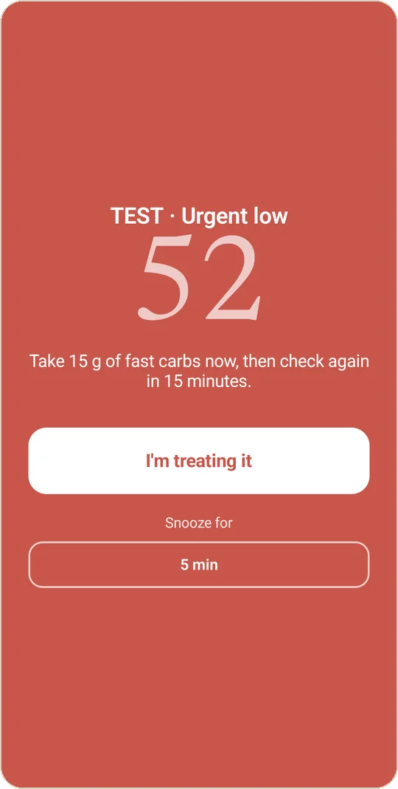

<sub>Now, Trends, and the urgent-low alert. Screenshots from the app on an emulator, with two weeks of demo data.</sub>

</div>

> [!IMPORTANT]
> **Not a medical device.** Sukoon is personal software, built in the open by someone who wears a Libre 2 every day. It is not cleared by any regulator. Never make an insulin, medication or treatment decision from a Sukoon reading alone: check with a finger-prick meter first. The app asks you to accept this before it shows a single number.

---

## 🌊 Why this exists

I have type 1 diabetes and I live in Egypt, on EU-bought Libre 2 sensors. The official LibreLink app is clinical and loud, and LibreLinkUp sharing doesn't work reliably here. The community app I used instead, **DiaBox**, reads the sensor directly over Bluetooth, which is the part that matters, but it is closed source (its decoding sits in packed native libraries), cramped, drops the Bluetooth link without saying so, and has nothing for the night a low goes unanswered.

**Sukoon** (سكون) is Arabic for *stillness*. That is also the clinical goal: a steady, in-range line. So the name is the brief, and the app has to keep to it:

| | The rule | What it means in practice |
| :-- | :-- | :-- |
| 🩺 | **Direct** | Sukoon pairs with the sensor itself (one NFC scan, then Bluetooth every minute). No reader app, no cloud, no PC in the middle. |
| 🔔 | **Alarms that reach you** | Lows sound on the alarm stream, through Do Not Disturb, over the lock screen, even with notifications blocked. The app checks that they *can* reach you and tells you what to fix. |
| 🚨 | **Someone gets told** | An urgent low nobody answers turns into a 60-second countdown, then a text to every emergency contact and a call to the first. |
| 🌿 | **Calm** | Plain words instead of clinical readouts, one next step instead of a wall of numbers, colour *and* motion for state so it works for colour-blind eyes too. |
| 🛡️ | **Safe by construction** | A sensor Sukoon can't decode is never taken over. Stale numbers grey out after 10 minutes. Calibration is capped and can never raise a low. Demo data can never sound an alarm. |
| 👪 | **Family can follow** | From Sukoon on their phone, or from a web page on any phone, iPhone included. People on Abbott's or Dexcom's apps can be followed too. |
| 🆓 | **Free** | $0 a month. The only online services are free tiers, and every one of them is optional. |

---

## 🌿 A tour

<table>
<tr>
<td width="33%">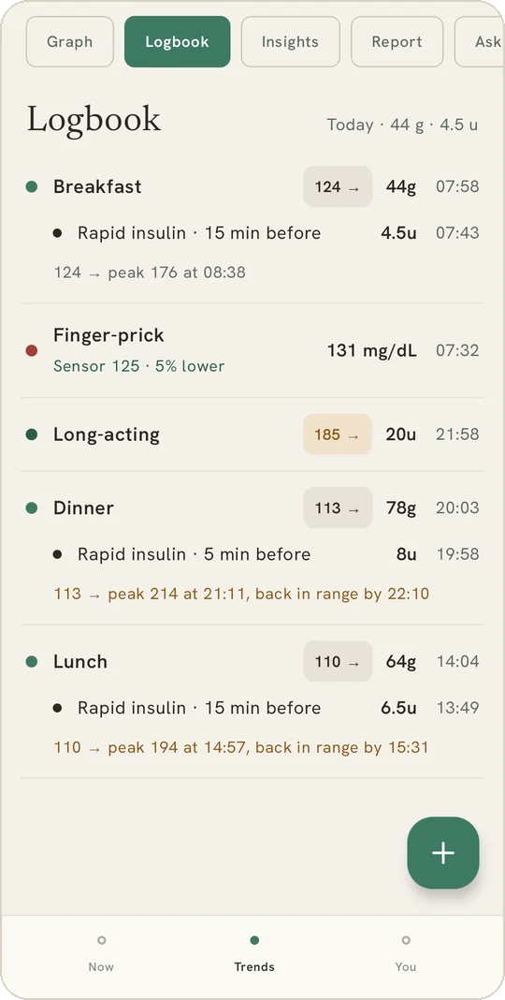</td>
<td width="33%">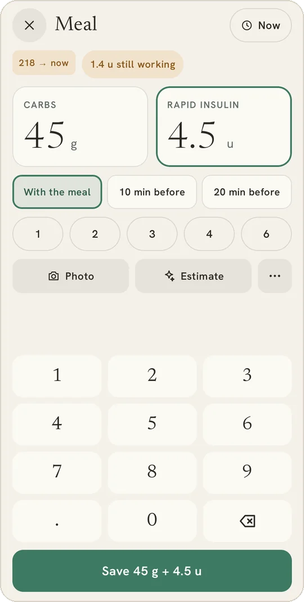</td>
<td width="33%">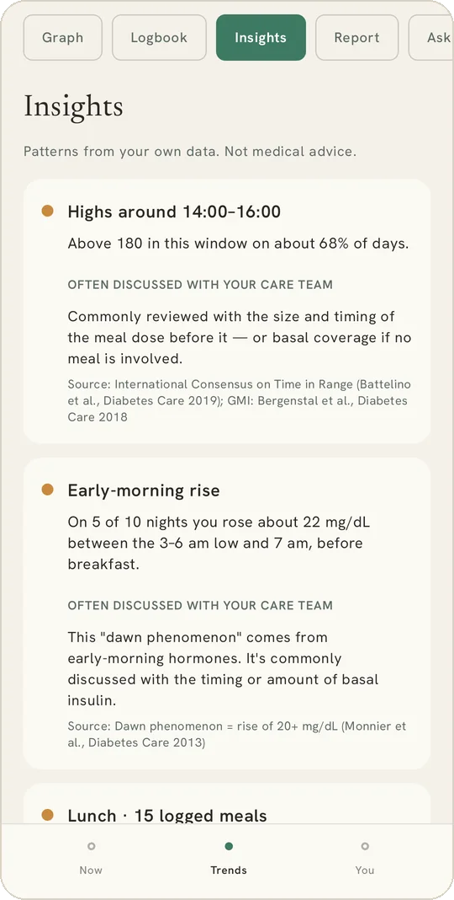</td>
</tr>
<tr>
<td><b>Logbook.</b> Every meal shows what it did: the glucose before, the peak, and when it came back into range. Finger-pricks sit beside the sensor's number at that minute.</td>
<td><b>Adding an entry.</b> A meal and its insulin on one screen, with when you injected. Big keys, no required fields, undo after saving.</td>
<td><b>Insights.</b> Patterns from your own two weeks, each with the published target or study it's measured against. Never a dose change.</td>
</tr>
<tr>
<td>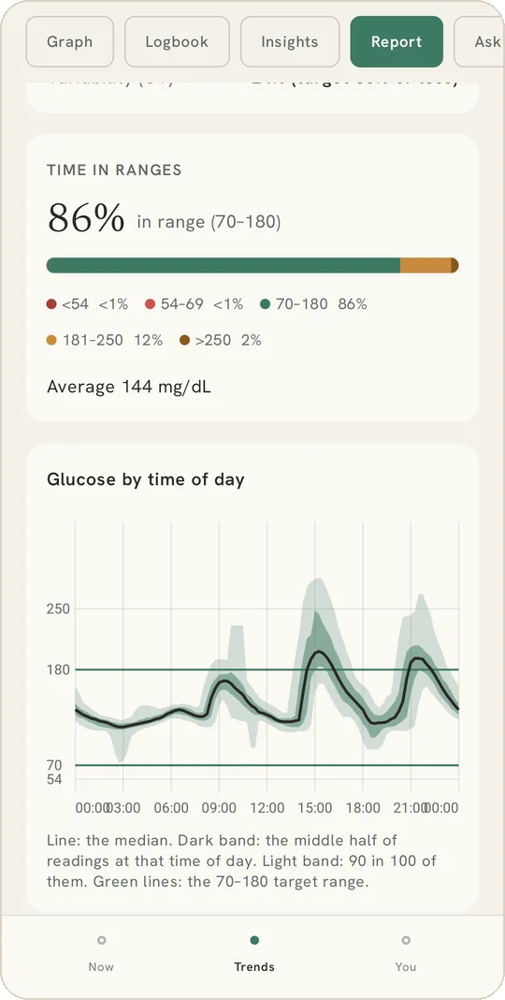</td>
<td>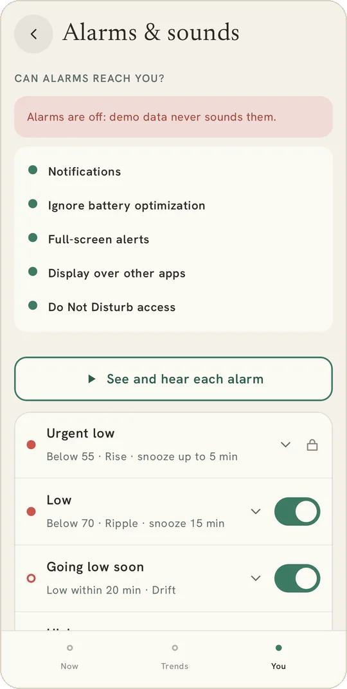</td>
<td>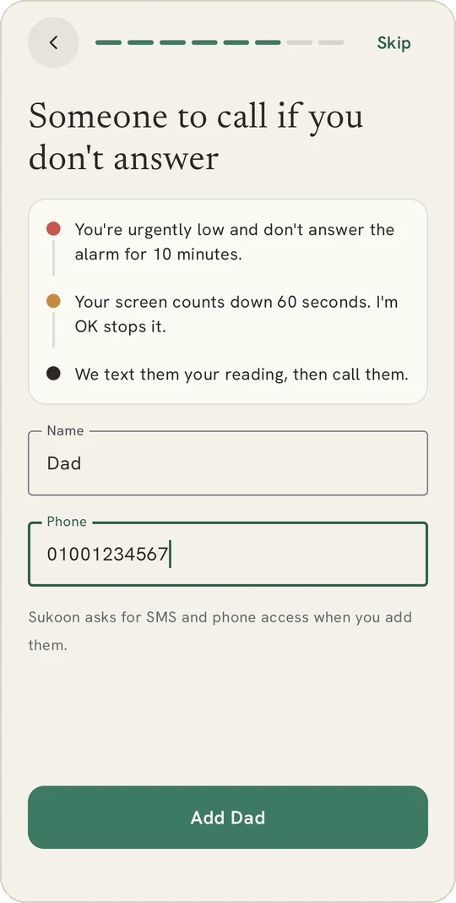</td>
</tr>
<tr>
<td><b>Report.</b> The Ambulatory Glucose Profile your doctor knows, over 7, 14 or 30 days, as a one-page PDF.</td>
<td><b>Alarms.</b> Sukoon checks what Android could block and offers a fix for each. On demo data it says plainly that alarms are off.</td>
<td><b>Emergency contact.</b> Part of first run, in three lines: what triggers it, how to stop it, what they receive.</td>
</tr>
</table>

---

## 📦 Install

1. On the phone, download the newest **`sukoon-x.y.z.apk`** from the [**Releases page**](https://github.com/khairyKY/sukoon/releases/latest) (Android 8.0 or newer, NFC and Bluetooth needed for a sensor).
2. Open it. Android will ask you to allow installs from your browser or file manager: allow it for this install.
3. Accept the not-a-medical-device screen, pick who you are (**I wear a sensor**, **I follow someone**, or **both**), and follow the steps for that role.

> [!NOTE]
> **Why Android warns you.** Sukoon isn't on the Play Store, so Android treats it like any app from outside the store. Every release lists the APK's SHA-256 so you can check the file you downloaded, and the whole source is here to read. Updates from the Releases page install over the old version and keep your data.
>
> **Coming from 0.6 or earlier?** Those builds were signed with a debug key; later ones are signed with Sukoon's own key, and Android won't update across keys. Once: **You → Reports → Backup → Back up everything**, uninstall, install the new build, then **Restore**. Readings, logbook, settings, alarms, the sensor pairing and meal photos all come back ([`docs/signing.md`](docs/signing.md)).

### On iPhone, or without the app

Sukoon isn't in the App Store: an iPhone can't pair a Libre with a free Apple account. **Following works on any phone**: the person wearing the sensor sends an invite from You → People, and the follower opens the [**follow page**](https://khairyky.github.io/sukoon/) in Safari → Share → **Add to Home Screen**, then signs in and types the code. The page walks through it, in English or Arabic. Alarms there sound only while it's open, so keep emergency contacts set. Step by step: [`docs/iphone-and-web.md`](docs/iphone-and-web.md).

Someone who only follows sees a simpler app: no sensor, insulin or dose settings, just who they follow, those alarms, the look and help (*I wear a sensor too* brings the rest back).

### Pairing a sensor

**You → Sensor → Connect**, then hold the phone to the sensor. Sukoon reads it over NFC, checks that it can decode it, and only then switches on its Bluetooth stream. From there a reading arrives every minute, a new sensor counts down its 60-minute warm-up on Home, and Sukoon reminds you 3 days, a day and an hour before the sensor ends.

> [!WARNING]
> **A Libre 2 streams to one phone at a time.** Pairing Sukoon takes the sensor's Bluetooth from whichever app had it (LibreLink, DiaBox, xDrip+). To hand it back, scan the sensor once with the other app. To try Sukoon on a second phone, use **Follower** with an invite code from the first phone, or demo data.

---

## ✨ What it does

✅ built and in daily use · 🌱 built, still being checked on a real phone · 🗓 planned

### Now: the number, and what to do about it

- ✅ **Home in one glance.** A large serif reading, the trend arrow, how old it is, the last 3 hours as one bar per 15 minutes (a low or a high inside one shows instead of being averaged away), insulin still active, and up to four stats you pick (carbs, calories, active insulin, time in range, steps, water…).
- ✅ **One message, one next step.** Sixteen rules, most urgent first: *heading low, have carbs ready*; *insulin still working, don't stack another dose*; *rebound after a low, let it settle*; *quiet night*. The message never suggests an insulin dose (dose suggestions are a separate beta, below). The full list is in [`docs/behaviour.md`](docs/behaviour.md).
- ✅ **Your own range.** 70 to a top you choose, 120–180 (70–140 is *time in tight range*). Home, the graph, widgets and the status bar use it; Insights and the doctor report keep the international 70–180 and show yours beside it.
- ✅ **Lows walk you through the 15-15 rule.** *I've treated it* stops the alarm, counts down 15 minutes, then asks you to check, and says *Still low, have another 15 g* if you are.
- ✅ **Every state has its own screen:** no sensor, warming up, in range, high, low, urgent, signal lost (the last value greyed with how long ago), and sensor ended.
- ✅ **Glucose in the status bar.** The number itself is the notification icon, with the arrow and age in the shade.
- ✅ **Home-screen widgets.** Seven styles (Number, Number + graph, Graph, Ring, Today, Insulin with a *Took it* button, Following), from 1×1 to half the screen, built in a widget maker that previews the real widget with your numbers.

### Log: quick entry first

- 🌱 **Meals built from foods.** Search foods and brands in Arabic or English, or scan a barcode with Sukoon's own camera (it opens at once and reads offline). Packaged foods come from [Open Food Facts](https://world.openfoodfacts.org) with their photos; 88 Egyptian and Middle-Eastern home dishes (ملوخية, كشري, محشي, عيش بلدي…) are built in with sourced carbs; anything else, *Ask the AI*. Pick ¼, ½ or a whole pack, a bowl or a serving, or type your amount in grams or portions. The plate adds up the carbs, fibre, protein, fat and calories, the dose suggestion works from it, and your usual foods are one tap at the amount you last had.
- ✅ **Meals, rapid and long-acting insulin, finger-pricks and activity** from big tiles and a number pad. A meal and its insulin save together, with pre-bolus minutes and *when it happened* (now, 15/30/60 minutes ago, or a picked time). Every entry shows the glucose at that moment. Undo on every save.
- ✅ **Insulin on board** on the exponential curve OpenAPS and Loop use (peak 75 minutes, 5 hours by default), shown on Home and before you log another dose.
- ✅ **Finger-pricks beside the sensor.** Each check shows the sensor reading at that minute and whether the two agree, and sits on the graph as a ring.
- ✅ **Long-acting reminder.** A daily nudge at your time unless the dose was already logged, with *Took it* right on the notification.
- 🌱 **Injection sites.** *Where?* on rapid and long-acting entries: two figures, front and back, one tap for the spot and the side. The spot rested longest is suggested, the last 30 days show as a body map, and an insight says when one spot takes most of your doses.
- 🌱 **Dose suggestions (beta, off by default).** Carb counting with a ratio per meal (breakfast, lunch, dinner, late), how far 1 unit lowers you, and a target; any box can stay empty. A new rapid entry shows the suggested dose with its maths line by line, rounded down to your pen (whole units by default) and capped at your maximum. Nothing is suggested when you're low or dropping. *Use* fills the amount; only Save logs it. Above your range and not eating, Home shows a correction the same way.
- 🌱 **Starting ratios for when you don't know yours.** From your logged daily insulin (the 500 and 1800 rules), else your weight and age (0.5 u/kg a day for adults, 1.0 for 12–17, 0.7 under 12: the cautious end of the ADA and ISPAD ranges), else the common adult start.
- 🌱 **Learning from your meals.** Every meal of the last 30 days gets a verdict. Clean ones (logged with their insulin, nothing else eaten for 4 hours, none still working, no workout) say what ratio they needed; a least-squares fit over every usable meal and correction finds how far 1 unit lowers you and each meal's ratio, with no numbers to start from. Each suggestion shows its meals, moves your number at most 20% per *Use*, and Home says when one is ready. Never changed by itself. The whole review exports as CSV.
- 🌱 **Parent lock.** A PIN (kept as a salted hash) that guards the alarms, your range, dose settings and profile. Under 18, dose suggestions only switch on behind one.
- ✅ **Every meal shows what it did.** Tap any meal: its carbs and the insulin taken for it (or *Add insulin*), its photos, a *rich meal* note when fat and protein can keep you rising for hours, the glucose curve around it, and one list of everything in it.
- ✅ **As many photos as you like** on a meal, and the AI carb estimate reads them all.
- ✅ **MyFitnessPal through Health Connect.** MyFitnessPal shares a running total per day, not meals, so Sukoon splits it back into meals at the time you log each one; *When did you eat?* sets the real time and *What was it?* names it (the foods themselves stay in MyFitnessPal). Workouts, steps and water come in too. Pull down on Home to sync. Readings go back out to Health Connect as blood glucose.

### Trends: understand the week

- ✅ **The graph:** 3 hours to 14 days, the line coloured by range with gaps left as gaps, time in range in five bands, average and GMI, and every reading listed underneath.
- ✅ **Any day, back as far as you have data.** The logbook and the graph both have a *‹ Today ›* bar: a day back, a day on, or tap it for a calendar.
- ✅ **Insights**, each with its source: time in range against the international consensus targets, variability (CV), recurring lows and highs, the dawn rise, what each meal did, pre-bolus timing, insulin stacking, this week against last, lows after workouts, highs after treating a low, one injection spot taking most doses. With a tighter range of your own, its share sits beside the international one.
- ✅ **Report for your doctor:** an Ambulatory Glucose Profile (5–95, 25–75 and median by time of day) over 7, 14 or 30 days with GMI and CV, exported as a one-page A4 PDF.
- ✅ **Ask.** A chat about your own data, and carb estimates from a meal photo or a description, through Google's Gemini with **your own free API key**. It sees summaries, not raw readings, and an estimate only ever pre-fills a field you confirm.

### Share: the people who'd want to know

- ✅ **Emergency contacts** from the phone book. See [the escalation](#-alarms-that-reach-you) below.
- 🌱 **Followers.** Invite someone with a one-time code. In the app, they see your live number, chart and Home message on their own phone and get your alarms with your name on them. Runs on Supabase with row-level security; an account is optional if you only wear a sensor.
- 🌱 **Follow from any phone's browser, iPhone included.** The [follow page](https://khairyky.github.io/sukoon/) shows the same number, arrow, 3-hour chart and words, in English or Arabic, installs to the home screen, and sounds an alarm while it's open. *Send* in You → People shares the code and the link in one message.
- 🌱 **Follow anyone on Abbott's or Dexcom's apps.** Sign in to LibreLinkUp or Dexcom Share and those people sit next to your Sukoon follows, with the same Home, widget and alarms. Either connection can also be *this phone's* glucose, which is how a Libre 3 wearer can use Sukoon.
- ✅ **Nightscout upload** (readings, treatments and finger-pricks), **CSV export**, and **Backup**: one zip with the database, every setting, the sensor pairing and the meal photos, restored in one step.
- 🌱 **Daily backup to your own cloud** (opt-in): pick a file in Google Drive, OneDrive, Dropbox or any cloud app on the phone with Android's own *save to*, and Sukoon refreshes it once a day. *Back up now* and *Stop* in You → Reports.

### Everything else

- ✅ **Your sensor at a glance.** You → Sensor says *Live*, *Reconnecting* or *No signal* from the last reading, puts what needs you on top in red or amber (Bluetooth off, no readings, sensor ending, ended) with the fix one tap away, and shows the sensor's life as a bar that turns amber 3 days before the end. Bluetooth off also shows on Home, and a notice comes 3 days, 1 day and 1 hour before the sensor stops.
- ✅ **English and Egyptian Arabic**, right to left, with the language picked inside the app (1,385 strings in each, checked for parity), and a **12- or 24-hour clock** (or the phone's).
- ✅ **Light, dark or like the phone**, with motion from the design spec that turns off when the phone's *Remove animations* is on.
- ✅ **A built-in guide** (You → Guide) and a getting-started card on Home.
- ✅ **Starts after a reboot or update**, and a watchdog wakes it if the phone kills it.

---

## 🔔 Alarms that reach you

A CGM app is only as good as the alarm that wakes you at 3 a.m. Every alarm here gets a notification, a full-screen alert over the lock screen, and its own sound. Sukoon's sounds come in five packs, all synthesized for it ([`tools/make_sound_packs.py`](tools/make_sound_packs.py)): **Astral** (space, calm; the default), **Orbit** (space, modern), **Glass**, **Clear** (the rhythm of hospital monitors) and **Bells**. Pick one in You → Alarms → Sounds; any alarm can still use a phone sound or your own file, and a broken file falls back rather than going silent.

| Alarm | Fires | Default | Can you change it? | Sound | Repeats |
| :-- | :-- | :-- | :-- | :-- | :-- |
| **Urgent low** | under 55 | always on | No. It can't be turned off or moved | the pack's urgent sound, looping a minute | every 5 min, snooze capped at 5. Lifts alarm volume to 80% |
| **Low** | under your line | 70 | line 60–110, on/off | the pack's low sound, 30 s | after its 15-min snooze. Lifts volume to 50% |
| **Going low** | heading under your line within 20 min | on | on/off | the pack's, 8 s | once per episode |
| **High** | over your line | 180 (follows your range) | line 120–400, on/off, quiet hours | the pack's, 8 s | after its 60-min snooze |
| **No readings** | no reading for N min | 20 min | 10–120, on/off | the pack's, 8 s | every 30 min |

Alarms only ever come from real readings: the sensor, or a LibreLinkUp or Dexcom connection used as this phone's glucose. Demo data never sounds one.

**Can alarms reach you?** You → Alarms checks notifications, full-screen permission, display over other apps, Do Not Disturb access, and battery restrictions including the phone maker's own, with a one-tap fix for each. **What your alarms did** keeps the last 60 alarm events and says in red when one didn't get through. **See and hear each alarm** runs any alarm's real path with a sample value, marked TEST.

### When nobody answers

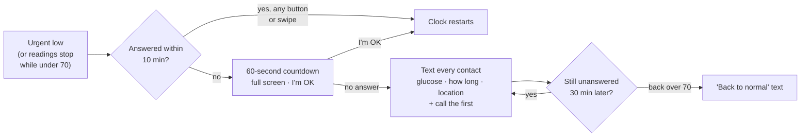

Emergency texts are only ever sent from the wearer's phone, never a follower's, and demo data can't start any of this.

---

## 🎨 Colour, and a second channel

State is carried by colour **and** by motion and wording, so it reads for colour-blind eyes and from the corner of your eye.

| State | Colour | What changes besides colour |
| :-- | :-- | :-- |
| **In range** 70–180 | Sage `#3E7A63` · `#82BBA0` | A slow live pulse; calm wording that changes by the hour, not by the reading |
| **High** over 180 | Amber `#C88A3E` | Wording by how long and how high; water and a walk past an hour |
| **Low** 55–69 | Coral `#C9564B` | The 15-15 steps and *I've treated it* |
| **Urgent** under 55 | Coral `#C9564B` | Full-screen entrance, a breathing reading, *Do this now* |
| **Signal lost** | Grey wash | The last value greyed, its age, help to reconnect |

Low and urgent share one red on purpose: severity is told by the banner, the words and the sound, not by a second, angrier red. Type is Newsreader for the number and headings and Hanken Grotesk for everything else. The design source is in [`_design-export/`](_design-export/).

---

## ⚙️ How it works

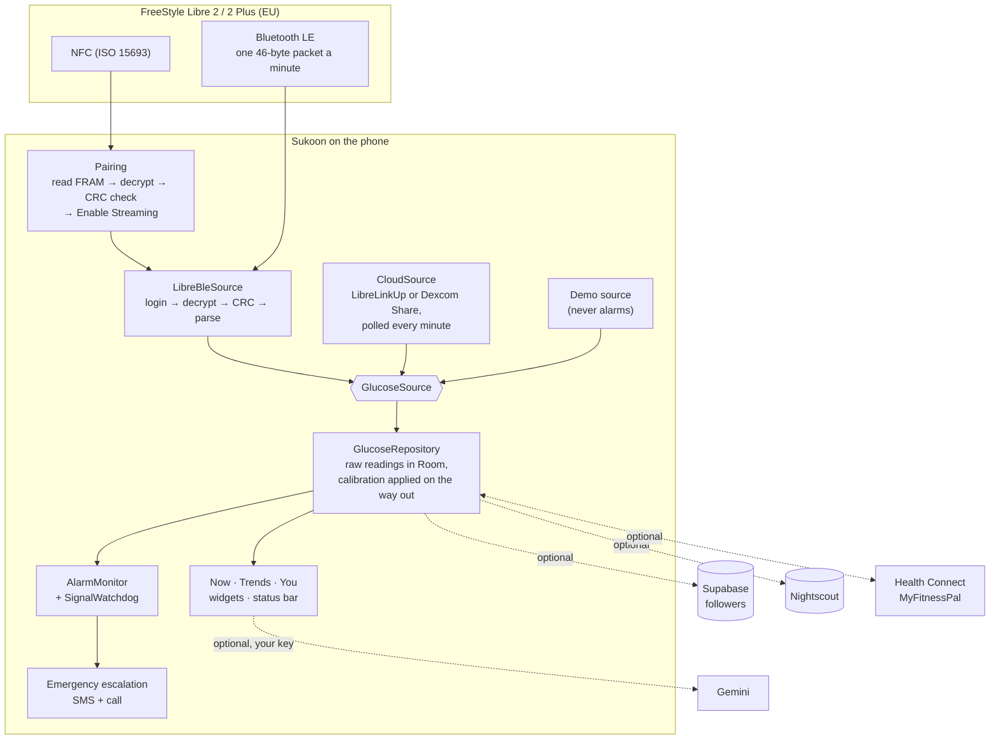

**Three decisions shape everything else:**

1. **One `GlucoseSource` interface, very different sources behind it.** The whole app (Home, graph, alarms, widgets, uploads) reads from the repository, which reads from whichever source is active: the sensor over Bluetooth, a LibreLinkUp or Dexcom connection, or demo data. The UI was built and tested on simulated data while the sensor pipeline was being reverse-engineered, and switching to the real sensor changed nothing downstream. The rule that only real readings may sound an alarm lives in one place.
2. **Never take over a sensor we can't read.** Enable Streaming is the one command that changes the sensor's state. Sukoon sends it only after the sensor's memory has decrypted with valid checksums, so a firmware it doesn't understand stays with the app that does. Every Bluetooth packet is CRC-checked before it becomes a number. Wrong crypto doesn't crash, it produces plausible wrong glucose, so the pipeline was checked against DiaBox on the same sensor (within ±3% minute by minute) before anyone trusted it.
3. **Stored readings stay raw.** Calibration (opt-in, from your finger-pricks) is a weighted least-squares fit applied when readings are read out, capped at ×0.8–1.25 and ±20 mg/dL, with fast-moving and disagreeing pairs left out, and it never raises a reading under 70. Turn it off and every past number is exactly what the sensor said.

<details>
<summary><b>The Libre 2 pipeline, step by step</b></summary>

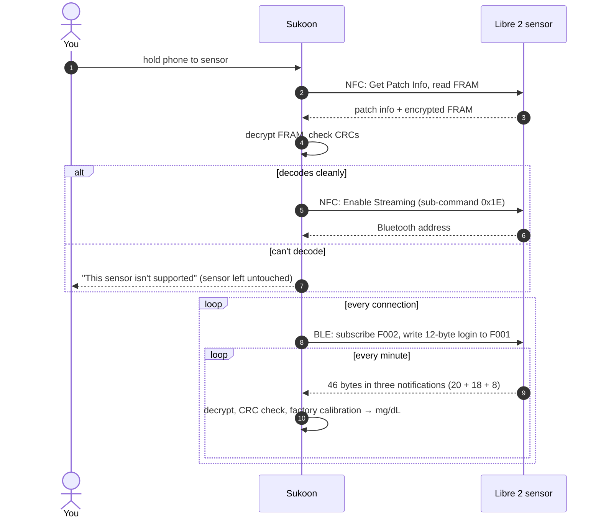

The decoding is a Kotlin port of [GlucoseDirect](https://github.com/creepymonster/GlucoseDirectApp)'s MIT-licensed implementation, with test vectors generated by an independent Python transliteration in [`tools/libre2_reference.py`](tools/libre2_reference.py).

</details>

<details>
<summary><b>Stack</b></summary>

| Layer | Choice |
| :-- | :-- |
| Language and platform | Kotlin 2.0, Android 8.0+ (minSdk 26, targetSdk 35) |
| UI | Jetpack Compose, Material 3, hand-drawn Canvas charts (no chart library) |
| Widgets | Jetpack Glance |
| Storage | Room (SQLite) with Kotlin Flows as the single source of truth |
| Wiring | A plain `AppContainer`, no DI framework |
| Background | A connected-device foreground service, exact alarms as a watchdog, boot receiver |
| Health data | Health Connect client 1.1.0-beta01 |
| Online (all optional) | Supabase over plain HTTPS (Auth, PostgREST, RLS; no SDK), LibreLinkUp and Dexcom Share (the APIs their own apps use), Nightscout API, Gemini REST |
| Follow page | One static page in [`web/`](web/) on GitHub Pages, reading the same Supabase with the publishable key |
| Reports | Android `PdfDocument`, same renderer as the screen |
| Quality | 162 unit tests: metrics, Libre crypto vectors, alarm rules, Home messages, insights, calibration, insulin on board, LibreLinkUp and Dexcom parsers |

</details>

---

## 🔒 What leaves your phone

Nothing, unless you turn it on. There are no analytics, no ads and no tracking of any kind.

| Data | Goes to | Only when |
| :-- | :-- | :-- |
| Readings, logbook, photos, your profile and dose settings | Your phone (app-private) | always |
| Readings out, meals in | Health Connect, on the phone | you grant Health Connect access |
| Your live readings | Your Supabase account, readable only by people you approved (row-level security) | you sign in and invite a follower |
| Your LibreLinkUp or Dexcom login | Abbott's or Dexcom's servers, to fetch the readings you're allowed to see | you sign in to follow someone there, or use it as your glucose |
| Readings and treatments | Your own Nightscout site | you add its address and token |
| Summaries of your data, your profile and dose settings, meal photos, a dish you ask about | Google Gemini, with your own API key | you add a key and ask a question or for an estimate |
| What you type in food search, or a barcode you scan | Open Food Facts (free, open data), to find the food | you search or scan |
| A full backup (readings, logbook, photos, settings, your AI key) | One file in the cloud app you chose | you turn on the daily cloud backup |
| Glucose, how long, location | Your emergency contacts by SMS and phone call | an urgent low goes unanswered |

**Cost:** Supabase, Gemini's free tier and Nightscout on your own machine are all $0. The app itself has no subscription, no account requirement and no server of its own.

---

## 🩺 Troubleshooting

| Symptom | What to do |
| :-- | :-- |
| An alarm didn't sound | Open **You → Alarms**. *Can alarms reach you?* lists what's blocking it, and *What your alarms did* shows what got through each time. |
| Readings stop when the screen is off | Your phone maker is killing background apps. Set Sukoon's battery to **Unrestricted** and follow the phone maker's page that the setup checklist opens (see [dontkillmyapp.com](https://dontkillmyapp.com)). |
| "Signal lost" every so often | **You → Sensor** shows the last 24 hours of gaps. Short gaps are usually distance: keep the phone on the same side of your body as the sensor. |
| Sukoon can't find the sensor after pairing | Another app has it. Force-stop LibreLink, DiaBox or xDrip+, then **You → Sensor → Connect** and scan again. |
| No MyFitnessPal meals | **You → Apps & data → Resync** says how many meals Health Connect has. If it has none, sharing is off on MyFitnessPal's side (More → Apps & Devices → Health Connect). |
| A MyFitnessPal meal shows the wrong time | MyFitnessPal shares totals, not meal times: a meal is timed when you logged it. Tap it, then *When did you eat?* |
| Food search finds nothing | Open Food Facts needs the internet; your own foods and the home dishes work offline. Missing a product? Scan it and add it as your own, or *Ask the AI*. |
| Ask says it's busy | Gemini's free tier is overloaded. Sukoon already falls back through three models; wait a minute. |
| "App not installed" when updating | The new build is signed with a different key (0.6 and earlier used a debug key). Back up, uninstall, install, restore: see [Install](#-install). |

---

## 🛠️ Development

You need **JDK 17** and the Android SDK (compileSdk 35). Android Studio works as-is.

```bash
git clone https://github.com/khairyKY/sukoon.git
```

| Task | Command |
| :-- | :-- |
| Compile | `./gradlew :app:compileDebugKotlin` |
| Unit tests | `./gradlew :app:testDebugUnitTest` |
| Debug APK | `./gradlew :app:assembleDebug` |
| Release APK, signed with Sukoon's key | `./gradlew :app:assembleRelease` |
| Release APK, debug-signed (updates 0.6-era installs in place) | `./gradlew :app:assembleRelease -PdebugSigned` |

On the emulator, pick **Demo** as the source to try every screen without a sensor. Followers need a Supabase project: run [`supabase/migrations/`](supabase/migrations/) in its SQL editor and put the project URL and *publishable* key in `local.properties` (gitignored). Never put the service-role key in the app. The release key and its passwords live only on the build machine ([`docs/signing.md`](docs/signing.md)).

<details>
<summary><b>Repository layout</b></summary>

```
sukoon/
├─ app/src/main/java/com/sukoon/app/
│  ├─ data/source/libre/   NFC pairing, BLE stream, Libre 2 decryption, factory calibration, sensor life
│  ├─ data/                Room database, repository, prefs, Nightscout + CSV export
│  ├─ domain/metrics/      time in range, GMI, SD/CV and friends: pure Kotlin
│  ├─ alarms/              alarm rules, sounds, full-screen alerts, watchdog
│  ├─ emergency/           unanswered-low escalation: countdown, SMS, call
│  ├─ sharing/             Supabase accounts and invites, LibreLinkUp, Dexcom Share, follower watch
│  ├─ health/              Health Connect sync (MyFitnessPal)
│  ├─ insights/ reports/   insight engine, AGP + PDF
│  ├─ insulin/ calibration/ reminders/ ai/
│  └─ ui/                  Now · Trends · You, logbook, onboarding, guide, widgets, theme
├─ app/src/test/           162 unit tests
├─ web/                    the follow page (any browser, iPhone included), published to GitHub Pages
├─ supabase/migrations/    followers schema with row-level security
├─ tools/                  Libre test-vector reference in Python, and the alarm-sound synthesizer
├─ docs/
│  ├─ behaviour.md         every state, rule and answer: the contract the code follows
│  ├─ full-build-backlog.md  what's built and what's next
│  ├─ signing.md           the release key, and moving a phone off the old debug key
│  ├─ PLAN.md · track-a-plan.md · track-b-plan.md   the original plan and both tracks
│  └─ research/            the research and the DiaBox APK analysis
└─ _design-export/         the design source, English and Egyptian Arabic
```

</details>

See [`CONTRIBUTING.md`](CONTRIBUTING.md) for branch and commit conventions. Sensor code may only be ported from MIT-licensed projects; GPL code (xDrip+, Juggluco) stays out.

---

## 🗺️ Roadmap

| | Status |
| :-- | :-- |
| Direct Libre 2 / 2 Plus EU, alarms with Sukoon's own sounds, emergency escalation, logbook, insulin on board, calibration, insights, AGP report, widgets, Health Connect, Nightscout, CSV, backup, English + Arabic | ✅ built |
| Followers on Supabase, the follow page for iPhone and any browser, LibreLinkUp and Dexcom Share | 🌱 built, being set up for daily use |
| Dose suggestions and learning your ratios (beta), injection sites, your own range, parent lock, sound packs | 🌱 built, being tested daily |
| Meals from foods (Open Food Facts, barcodes, home dishes, the AI), any day in the logbook and graph, cloud backup | 🌱 built, being tested daily |
| Libre 1 and 2 through a Bubble transmitter | 🗓 possible: portable from GlucoseDirect, needs a transmitter to test |
| Libre 3 / 3 Plus over Bluetooth | ✖ the open implementations depend on Abbott code under GPL, so it can't be ported. A Libre 3 works today through LibreLinkUp. |

What's built and what's next, in order, lives in [`docs/full-build-backlog.md`](docs/full-build-backlog.md).

---

## 🙏 Standing on

- **[GlucoseDirect](https://github.com/creepymonster/GlucoseDirectApp)** by Reimar Metzen (MIT): the Libre 2 decoding Sukoon's is ported from. It credits **[DiaBLE](https://github.com/gui-dos/DiaBLE)** by Guido Soranzio and **[LibreTools](https://github.com/ivalkou/LibreTools)** by Ivan Valkou (both MIT). Notices in [`THIRD_PARTY_NOTICES.md`](THIRD_PARTY_NOTICES.md).
- **[DiaBox](https://www.diaboxapp.com/)** and **[xDrip+](https://github.com/NightscoutFoundation/xDrip)**, which proved that direct Bluetooth readings change daily life.
- **[OpenAPS](https://openaps.org/)** and **[Loop](https://loopkit.github.io/loopdocs/)** for the insulin activity curve, and the international consensus on time in range for the targets.
- **[Nightscout](https://nightscout.github.io/)**, **[Supabase](https://supabase.com)**, **[Health Connect](https://developer.android.com/health-and-fitness/guides/health-connect)**.
- Type: **Newsreader** and **Hanken Grotesk**, bundled under the SIL Open Font License.

## ⚖️ License

There's no license file, so all rights are reserved by default: the source is public so you can read it, check it and learn from it. The Libre 2 code ported from GlucoseDirect, DiaBLE and LibreTools stays under their MIT licenses. If you want to reuse part of Sukoon, [open an issue](https://github.com/khairyKY/sukoon/issues) and ask.

<div align="center">
<br/>

<br/>
<sub><i>هدوء واستقرار، قراءة بقراءة</i></sub><br/>
<sub><i>stillness and stability, one reading at a time</i></sub>
</div>
