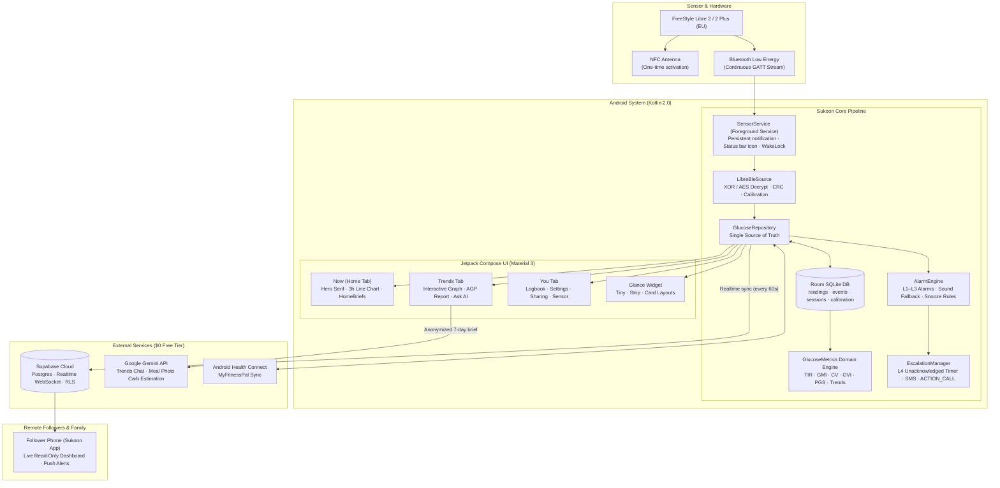

<div align="center">


# Sukoon (سكون)

**Still water for continuous glucose monitoring.**

A native Android CGM companion for the FreeStyle Libre 2 & 2 Plus (EU), streaming directly over Bluetooth with zero scanning,<br/>
medical-grade metrics, calm design, free real-time cloud sharing, and life-saving emergency escalation.


-2E5C4A?style=flat-square)

-82BBA0?style=flat-square)
-3E7A63?style=flat-square)
-3ecf8e?style=flat-square)

-8e74d0?style=flat-square)


[**Why Sukoon**](#-why-this-exists) · [**Features**](#-what-it-does) · [**The Water Metaphor**](#-the-water-metaphor-state-signaling--design) · [**Architecture**](#%EF%B8%8F-how-it-works) · [**Safety & Privacy**](#-safety-privacy-and-trust) · [**Setup & Build**](#-getting-started--building-from-source) · [**Troubleshooting**](#-troubleshooting) · [**Roadmap**](#%EF%B8%8F-roadmap)

<br/>

</div>

> [!IMPORTANT]
> **Not a medical device.** Sukoon is personal software built for educational, observational, and self-management use. Never make insulin dosing, medication, or clinical treatment decisions based on Sukoon readings alone — always verify with a finger-prick blood glucose meter. An in-app disclaimer gate must be reviewed and accepted on first launch before any readings are displayed.

---

## 🌊 Why this exists

Managing Type 1 or insulin-dependent diabetes requires checking glucose ~50 times a day, often while half-asleep, working, or driving. The current continuous glucose monitoring (CGM) app landscape is broken in two opposite directions:

1. **The official apps (FreeStyle LibreLink / Libre 3):** Visually sterile and clinical. Blaring, un-snoozable alarms that trigger alarm fatigue and wake the entire household. Closed ecosystems that lock your data behind proprietary clouds. In regions like Egypt and the Middle East, the cloud bridge (LibreLinkUp) frequently fails or is unavailable even for EU sensors.
2. **The DIY / community apps (DiaBox, xDrip+, Juggluco):** Pioneered direct Bluetooth reading without manual scanning, but DiaBox is closed-source, packed with Baidu Shell native obfuscation blobs, visually cramped, prone to unexplained silent Bluetooth drops, and completely lacks an automated emergency escalation safety net.

**Sukoon (سكون — Arabic for calm, quiet, stillness) was built to fix both.** Named because in diabetes management, *stability is stillness* — non-erratic, in-range glucose is the actual clinical goal, not just a mood.

| | The Rule | What it means in practice |
| :-- | :-- | :-- |
| 🌊 | **Calm (سكون)** | No medical dread, no fluorescent red panic screens. Dual-encoded color + motion (calm sage teals for in-range, warm amber for high, coral red for low/urgent). Reassuring, contextual copy instead of sterile error codes. |
| 🩺 | **Direct BLE** | Connects directly to the FreeStyle Libre 2 & 2 Plus (EU) via Bluetooth Low Energy GATT streams. One NFC tap activates streaming; from then on, a fresh reading arrives automatically every 60 seconds without scanning. |
| 🛡️ | **Non-Negotiable Safety** | First-launch disclaimer gate, strictly bounded calibration caps (math mathematically prevented from ever masking a hypo), and a stale-data guard that greys out to `---` after 10 minutes of silence so no one ever boluses off an old number. |
| 🚨 | **Emergency Escalation (L4)** | If an urgent low (<55 mg/dL) alarm goes unacknowledged, or Bluetooth disconnects while low, a full-screen 60-second cancellable countdown begins. If unanswered, Sukoon automatically sends SMS alerts with an optional GPS map link to emergency contacts and auto-dials your primary contact via `ACTION_CALL`. |
| 👥 | **Universal Sharing** | Free real-time cloud sharing on Supabase (Postgres + Realtime + Row-Level Security). Family members and caretakers log in on their own phones (or future desktop widgets) to see a live companion dashboard with instant push alerts. |
| 🆓 | **$0 / Month** | 100% free stack. Runs locally, syncs on free-tier Supabase, and uses your own free Google Gemini API key for optional meal/trend insights. |

---

## ✨ What it does

✅ shipped and in daily use · 🌱 being integrated or polished · 🗓 planned

### 📡 Sense & Connect: Direct hardware pipeline

- ✅ **Direct Libre 2 & 2 Plus (EU) BLE streaming.** One-time NFC pairing (ISO 15693 FRAM CRC-gated handshake) activates streaming. Continuous encrypted BLE GATT notifications decode via on-device XOR keystream / AES-CFB and factory calibration tables into mg/dL. Validated on real hardware against DiaBox (±3% on minute-by-minute readings).
- ✅ **Multi-source flexibility.** Choose your data source in **You → Sensor**:
  - *Direct Libre 2/2+ BLE*: The primary native engine.
  - *DiaBox / Juggluco broadcast*: Reads the local xDrip+-compatible `BgEstimate` broadcast on the same phone.
  - *Nightscout*: Polls any Nightscout REST instance (`entries/sgv.json`) with automatic 24-hour backfill.
  - *SimulatedSource*: Deterministic synthetic series for testing, UI previews, and automated verification without a physical sensor.
- ✅ **24/7 Background survivability.** Foreground service (`SensorService`) holds a wake lock and persistent notification. Survives Android Doze, screen-off, and aggressive OEM memory killers (Samsung, Xiaomi/MIUI, Huawei). Includes an in-app setup checklist to guide battery-optimization exemptions.
- ✅ **Status-bar glucose readout.** Live glucose number rendered directly as the Android status-bar notification icon, showing value, trend arrow, and reading age at a glance without opening the phone.
- ✅ **Start on boot & updates.** `BootReceiver` restarts the foreground collection service automatically when the phone reboots or the app updates.
- ✅ **Sensor lifecycle tracking.** Live warm-up countdown (60 minutes from pairing), ending warnings (24 hours and 1 hour remaining), and a dedicated "Sensor ended" home state with a one-tap prompt to connect a new sensor.

### 📱 Now: The calm home screen

- ✅ **7 Distinct home states.** In-Range (calm), Low, High, Urgent Low, Sensor Warm-Up, Signal Lost / Stale (`---` greyed guard), and No Sensor Connected.
- ✅ **Serif hero readout.** Giant, glanceable hero number in Newsreader (Amiri in Arabic) with 15-minute rate-of-change trend arrow (`↓↓`, `↓`, `→`, `↑`, `↑↑`) and delta change.
- ✅ **Continuous 3-hour line chart.** Canvas-drawn line over a shaded 70–180 mg/dL target band. Replaced DiaBox's 15-minute bar chart (which smoothed away short, dangerous dips) with an exact, continuous curve that reveals true volatility.
- ✅ **Contextual HomeBriefs.** An observational engine that synthesizes trend direction, active insulin decay, recent meals, time of day, and sensor age into one calm takeaway and one clear next step (e.g., standard 15-15 rule for lows), or *"Nothing to do right now."* Never prescribes a dose.
- ✅ **Active insulin on home.** Current Insulin on Board (IOB) displayed directly beside quick shortcuts.
- ✅ **Quick-log shortcuts.** One tap to log food or rapid insulin immediately from the hero screen.

### 📊 Trends & Clinical Insights

- ✅ **Interactive Canvas graph.** 3h, 6h, 12h, 24h, and up to 14-day history. Pan, inspect individual points, view gap breaks for connection drops, and see range-colored segments.
- ✅ **Clinical AGP (Ambulatory Glucose Profile).** Standard 14-day percentile curves (5th, 25th, median, 75th, 95th) plotted across 24 hours of the day to uncover recurring nocturnal dips and post-meal spikes.
- ✅ **Doctor-ready PDF export.** Generates a clean, single-page vector A4 PDF (`PdfDocument`) directly on the phone matching international consensus targets (TIR, TBR, TAR, GMI, CV). Share directly to WhatsApp, email, or print for your endocrinologist.
- ✅ **Deterministic clinical metrics module.** Pure Kotlin, 100% unit-tested math:
  - **Time in Range (TIR):** Standard 5-band breakdown (<54 very low, 54–69 low, 70–180 in-range, 181–250 high, >250 very high).
  - **GMI (%):** Glucose Management Indicator (estimated HbA1c) `= 3.31 + 0.02392 × meanGlucose`.
  - **Variability:** Standard Deviation (SD) and Coefficient of Variation (CV% target ≤ 36%).
  - **GVI & PGS:** Glycemic Variability Index (path length vs. baseline) and Patient Glycemic Status (piecewise sigmoids punishing severe hypoglycemia).
- ✅ **Ask Gemini AI.** Interactive chat exploring a compact 7-day numerical data brief (glucose patterns, meal outcomes, active insulin, sensor age). User brings their own free Gemini API key. Strict prompt guardrails ensure it analyzes trends without ever prescribing insulin doses.

### 📖 Logbook & Context

- ✅ **Anti-mySugr quick entry.** Fast, friction-free logging. Number pad + one tap is all that's required; tags, notes, and photos are optional, never mandatory.
- ✅ **Insulin on Board (IOB) engine.** Models rapid insulin decay using the OpenAPS / Loop exponential activity curve (peak 75 min, 5-hour duration). Warns against insulin stacking before injecting additional units.
- ✅ **Meal photos & AI carb estimation.** Capture or pick a meal photo; Gemini multimodal AI estimates carbohydrate grams to pre-fill the entry.
- ✅ **Health Connect two-way sync.** Background synchronization with Android Health Connect: imports MyFitnessPal meals and nutrients as logbook entries; exports interstitial blood glucose records without duplicates.
- ✅ **Finger-prick meter checks.** Dedicated logbook type for capillary meter readings (20–600 mg/dL). Displays sensor vs. meter agreement with standard 20/20 ISO error bands, plotted as ring markers on the graph.
- ✅ **Pre-bolus timing & meal tags.** Record injection time relative to eating (e.g., 15 minutes before) to analyze postprandial control.

### 🚨 Alarms & Life-Saving Escalation

- ✅ **Multi-tier alert hierarchy:**
  - **L1 Info:** Predictive trend notifications (e.g., heading low within 20 minutes).
  - **L2 Warning:** High and low glucose alerts with customizable thresholds and snooze rules.
  - **L3 Urgent Low (<55 mg/dL):** Full-screen takeover, loud alarm audio stream, Android Do Not Disturb (DND) bypass, and deliberate confirmation snooze (capped at 5 minutes).
- ✅ **Custom alarm audio with fallback chain.** Select system tones or pick personal audio files. Persisted URI permissions and preview testing on pick; automated fallback chain guarantees that a missing or corrupted audio file can never silence an alarm.
- ✅ **L4 Emergency Escalation.** Designed for nocturnal hypoglycemia or unconsciousness:
  - Triggered if an L3 urgent alarm goes unacknowledged for N minutes (default 10 min), or if Bluetooth connection is lost following a low reading.
  - Displays a full-screen, loud 60-second cancellable countdown: *"Calling [contact] in 60s — I'm OK"*.
  - If uncancelled: automatically sends emergency SMS with optional GPS location to designated contacts, then auto-dials the primary emergency contact via `Intent.ACTION_CALL`.
  - Sends automatic *"Glucose back to normal"* recovery texts when readings recover.
- ✅ **Quiet hours for highs.** Optional night-time suppression for high glucose alerts; low and urgent alerts always sound.

### 👥 Sharing & Followers

- ✅ **Supabase cloud sync.** Free-tier backend using PostgreSQL and Realtime with Row-Level Security (RLS). Readings upload securely every minute.
- ✅ **Companion follower viewer mode.** Loved ones log into the same Sukoon Android app, enter a one-time invite code, and gain read-only access to live glucose, trend arrows, 3-hour graphs, and emergency call/message shortcuts.
- ✅ **Background follower alerts.** Foreground service (`FollowService`) allows caretakers to receive immediate audible alerts if the wearer drops low.

### 🪟 Glance Widget & System Surfaces

- ✅ **Scalable Glance home-screen widget.** Resizable from 1×1 to half the screen:
  - *TINY:* Big glanceable number and trend arrow.
  - *STRIP:* Number, delta, age, and mini sparkline.
  - *CARD:* Large hero readout, today's Time in Range, and an exact pixel-rendered bitmap graph.
- ✅ **Widget customization:** Configurable background (Auto, Light, Dark, Clear), graph duration (off, 1h, 3h, 6h, 12h, 24h), and details toggle.
- ✅ **Stale widget guard:** Automatically displays `---` if readings are older than 10 minutes.

### 🌍 Bilingual & Accessibility

- ✅ **English & Egyptian Arabic.** 100% localized (589 string resources per language) with full Right-to-Left (RTL) mirroring and Arabic-Indic numerals.
- ✅ **Natural Egyptian medical phrasing.** Culturally authentic Egyptian dialect (السكر, هبوط, واطي, الحساس, أكلت إيه؟) rather than rigid machine translation.
- ✅ **Accessibility motion.** Designed to honor Android's "Remove animations" accessibility setting while providing calm fluid transitions for sighted users.

---

## 🌊 The Water Metaphor: State Signaling & Design

The visual language of Sukoon is built on **still water and ripples**. State is communicated across two simultaneous sensory channels: **color** and **motion/texture**, ensuring full accessibility for users with color vision deficiencies.

<div align="center">
  
  <br/>
  <sub><b>The Crescent Cradle:</b> A crescent cut from overlapping circles cradling a point of light — stillness with a single ripple.</sub>
</div>

### 🎨 Color Palette & Visual Tokens

| State | Primary Hex | Palette Role | Meaning & Clinical Context |
| :--- | :--- | :--- | :--- |
| **In-Range** | `#3E7A63` / `#82BBA0` | **Sage Teal Family** | Stillness, calm waters. Glucose is safely within target (70–180 mg/dL). |
| **High** | `#C88A3E` | **Warm Amber** | Warm sun, rising heat. Glucose above target (>180 mg/dL); requires attention, not panic. |
| **Low / Urgent** | `#C9564B` | **Coral Red** | Turbulence. Low (<70 mg/dL) and Urgent Low (<55 mg/dL). Differentiated by banner copy and alarm sound, not a second jarring hue. |
| **Canvas Light** | `#F4F1EA` | **Warm Paper** | High-legibility light theme background. |
| **Canvas Dark** | `#1E2B26` | **Deep Forest Ink** | Deep restful dark theme background. |

### 🪟 Home Screen States

| State | Visual Treatment | Hero Readout | Contextual Card |
| :--- | :--- | :--- | :--- |
| **In-Range** | Sage background tint, gentle static water | Large serif number + trend arrow | "Steady for 2 hours. Active insulin: 0.8 U." |
| **Low** | Coral red banner, action buttons | Number + bold downward arrow | "Heading low. Have 15g fast carbs (15-15 rule)." |
| **Urgent Low** | Full-screen takeover, pulsing breathing ring | Bold number + alarm sound | "Urgent low. Treat immediately. Escalation armed." |
| **High** | Warm amber accent | Number + upward arrow | "Above target. 2.1 U active insulin still working." |
| **Warm-up** | Neutral sage with countdown progress ring | Circular countdown timer | "Sensor settling. First reading in 42 minutes." |
| **Stale / Lost** | Muted grey wash, no colors | `---` with "Last seen 14m ago" | "Signal lost. Move phone closer or toggle Bluetooth." |
| **No Sensor** | Clean empty state with pairing button | Muted placeholder | "No sensor paired. Tap below to scan your Libre 2." |

> [!NOTE]
> The full visual specification and bilingual UI exports live in [`_design-export/Sukoon Brand Directions.dc.html`](_design-export/Sukoon%20Brand%20Directions.dc.html) and [`Sukoon Motion Spec.dc.html`](_design-export/Sukoon%20Motion%20Spec.dc.html). Open either file in any web browser to inspect typography, motion curves, and layout tokens.

---

## ⚙️ How it works

### System Architecture



---

### The Sensor Handshake & Decryption Pipeline

```mermaid
sequenceDiagram
  autonumber
  actor User
  participant App as Sukoon (Kotlin)
  participant NFC as Android NFC (NfcV)
  participant BLE as Android BLE GATT
  participant Sensor as Libre 2 EU Sensor
  participant DB as Room SQLite

  User->>App: Tap "Pair Sensor"
  App->>NFC: Enable reader mode (ISO 15693)
  User->>Sensor: Touch phone to sensor
  NFC->>Sensor: Read System Info + Patch Info (0xA1)
  Sensor-->>NFC: UID + Sensor Generation + Factory Calibration
  App->>App: Derive streaming unlock payload & BLE PIN
  NFC->>Sensor: Send activation command
  Sensor-->>App: Activation acknowledged; BLE advertising begins
  
  Note over App,Sensor: Streaming active for 14 days
  
  App->>BLE: Connect to Sensor UUID
  BLE->>Sensor: Establish GATT connection & write PIN
  Sensor-->>BLE: Auth accepted
  App->>BLE: Subscribe to glucose notification characteristic
  
  loop Every 60 Seconds
    Sensor-->>BLE: Raw encrypted notification packet (XOR/AES)
    BLE->>App: Deliver byte array
    App->>App: Decrypt payload with derived key
    App->>App: Validate CRC-16 check (reject corrupt packets)
    App->>App: Extract raw counter, temperature & sensor voltage
    App->>App: Apply factory calibration curve → calculate mg/dL
    App->>DB: Upsert GlucoseReading (idempotent timestamp index)
    App-->>User: Update Status Bar Icon & Compose UI
  end
```

---

### Tech Stack

| Layer | Choice | Rationale |
| :-- | :-- | :-- |
| **Language & Platform** | Kotlin 2.0.21, Android 8.0+ (API 26–35) | Native performance; critical for low-latency background Bluetooth stability. |
| **User Interface** | Jetpack Compose (BOM 2024.10.00), Material 3 | Declarative, reactive UI with custom Canvas rendering for smooth graph animations. |
| **Local Persistence** | Room 2.6.1 (SQLite) with Kotlin Coroutines Flow | Reactive single source of truth; live UI updates without database polling. |
| **Background Engine** | Android Foreground Service + WakeLock | Survives aggressive OEM background task killers; auto-restarts on reboot. |
| **Sensor Decryption** | Pure Kotlin port of GlucoseDirect / DiaBLE / LibreTools (MIT) | 100% clean-room community lineage. Free of GPL obligations. |
| **Metrics Math** | Pure Kotlin isolated domain module | Deterministic math with 136 passing unit tests (100% success rate). |
| **Cloud & Sharing** | Supabase (Postgres + Realtime + RLS) | Free-tier, SDK-agnostic cloud. REST & WebSockets enable future desktop viewers. |
| **AI Integration** | Google Gemini (User-provided API key) | Trends chat over compact data briefs and meal photo carb estimation. Never doses. |
| **System Widgets** | Jetpack Glance 1.1.1 (AppWidget) | Compose-based home-screen widgets rendering adaptive bitmaps at native resolutions. |
| **Health Sync** | Android Health Connect 1.1.0-beta01 | Interoperability with MyFitnessPal and commercial health tracking ecosystems. |

---

## 🔒 Safety, Privacy, and Trust

### Non-Negotiable Safety Invariants

1. **First-Launch Disclaimer Gate:** Tap-to-accept gate displayed before any reading can be viewed, reminding users that Sukoon is not an FDA-cleared medical device and finger-prick confirmations are mandatory before treatment.
2. **Stale-Data Guard:** If no fresh reading is received for >10 minutes, the hero value immediately greys out and displays `---`. Stale numbers are never shown as current to prevent dangerous insulin boluses based on outdated data.
3. **Capped Calibration:** Finger-prick calibrations are processed using weighted least-squares regression across recent steady readings. Adjustments are strictly capped to `×0.8–1.25` slope and `±20 mg/dL` offset. Calibrations taken during rapid glycemic shifts are automatically rejected, and a calibration can **never raise a reading below 70 mg/dL**.
4. **Cancellable Emergency Escalation:** The L4 emergency call feature always sounds an unmistakable full-screen alarm with a 60-second countdown window before triggering phone calls or SMS messages.

### Data Privacy Matrix

| Data Type | Where It Goes | Security & Privacy Guarantees |
| :--- | :--- | :--- |
| **Glucose readings & logbook events** | Stored locally in phone's SQLite DB | 100% local-first. Never transmitted anywhere unless cloud sharing is explicitly enabled. |
| **Cloud sharing records** | Your private Supabase database | Protected by Row-Level Security (RLS). Only authenticated users with approved invite codes can read your stream. |
| **AI trend questions & meal photos** | Google Gemini API (user's personal key) | Sent directly from device to Gemini via user's private key. Data brief contains only anonymous 7-day numbers (no names, emails, or hardware IDs). |
| **Emergency contacts & locations** | Native Android SMS / Telephony | Handled via direct system intents (`ACTION_CALL`, `SmsManager`). No third-party notification servers or brokers involved. |

### Cost Breakdown

| Service | Tier Used | Monthly Cost |
| :--- | :--- | :--- |
| **Local App Execution** | Runs on-device (Android) | **$0** |
| **Supabase Cloud Sync** | Free Tier (500 MB Postgres, Realtime WebSockets) | **$0** |
| **Google Gemini API** | Free Tier (personal API key) | **$0** |
| **Total** | | **$0 / month** |

---

## 📦 Getting Started & Building from Source

### Prerequisites

- **Android Studio Ladybug (2024.2.1+)** or command-line Gradle.
- **JDK 17** (configured as your Gradle JDK).
- **Android SDK:** `minSdk 26` (Android 8.0 Oreo), `compileSdk 35` (Android 15).
- A physical Android device with NFC and Bluetooth for sensor reading (the Android Emulator works for `SimulatedSource` development).

### 1. Clone the repository

```bash
git clone https://github.com/khairyKY/sukoon.git
cd sukoon
```

### 2. Run unit tests

Verify the clinical metrics, encryption, and state mapper test suites:

```bash
./gradlew test
```

*Expected output: `136 tests completed, 0 failures, 100% successful`.*

### 3. Build and install the debug APK

```bash
./gradlew assembleDebug
```

Connect your Android phone with USB debugging enabled, then install:

```bash
adb install -r app/build/outputs/apk/debug/app-debug.apk
```

### 4. Configure Supabase Cloud Sharing (Optional)

1. Create a free project at [supabase.com](https://supabase.com).
2. Open the SQL Editor in your Supabase dashboard and run the migration script:
   ```sql
   -- Found in supabase/migrations/20261003000000_followers.sql
   ```
3. In the Sukoon app, navigate to **You → Sharing** and enter your Supabase Project URL and Anon Public Key.

### 5. Configure Gemini AI (Optional)

1. Get a free Gemini API key from [Google AI Studio](https://aistudio.google.com).
2. In Sukoon, go to **You → Settings → AI** and paste your API key to enable Ask AI chat and photo carb estimation.

---

## 🩺 Troubleshooting

| Symptom | Probable Cause | Resolution |
| :--- | :--- | :--- |
| **Sensor won't pair via NFC** | NFC antenna misaligned or phone case too thick | Position the upper rear of the phone firmly against the sensor. Hold steady for 3–5 seconds until the phone vibrates. |
| **Readings stop when screen is off** | Android OEM battery optimization killed the service | Open **You → Setup Checklist** and grant exemptions for battery optimization and background activity (especially critical on Xiaomi MIUI, Samsung OneUI, and Huawei EMUI). |
| **Bluetooth disconnects with status 19** | Transient Android BLE stack drop | The built-in watchdog reconnects automatically within 2 minutes. If stubborn, toggle Bluetooth off and on in Android Settings. |
| **App shows `---` (stale guard)** | No valid BLE packet received in >10 minutes | Ensure the phone is within Bluetooth range (~5 meters). If you walked away, Sukoon will resume streaming automatically upon return. |
| **Emergency auto-call doesn't trigger** | Missing runtime `CALL_PHONE` permission | Verify that the Call permission is enabled in **Settings → Apps → Sukoon → Permissions**. |
| **US/Canadian sensor error** | Non-EU Libre 2 sensor | Abbott applies region-specific firmware locks. Direct BLE currently supports FreeStyle Libre 2 & 2 Plus European models. Use the *DiaBox broadcast* source for other regions. |

---

## 🗺️ Roadmap

| Milestone | Scope & Deliverables | Status |
| :--- | :--- | :--- |
| **Phase 0 — Foundation** | `GlucoseSource` abstraction, Room schema, metrics module (TIR, GMI, CV, GVI, PGS), unit tests, disclaimer gate. | ✅ Shipped |
| **Track A — App Core** | Compose navigation shell (Now, Trends, You), Room persistence pipeline, 3h–14d interactive Canvas graph, Glance widget. | ✅ Shipped |
| **MVP Bridge** | xDrip+ local broadcast receiver (`BgEstimate`), Nightscout polling, Gemini AI Ask chat & photo carb estimation. | ✅ Shipped |
| **Track B — Hardware BLE** | ISO 15693 NFC activation, BLE GATT subscription, XOR keystream decryption, CRC-16 check, factory calibration. Validated on Kai's hardware. | ✅ Shipped |
| **Clinical Suite** | Ambulatory Glucose Profile (AGP) 14-day percentiles, vector 1-page A4 PDF export for endocrinologists (`PdfDocument`). | ✅ Shipped |
| **Safety & Escalation** | Multi-tier alarms (L1–L3), custom sound fallback engine, L4 unacknowledged urgent low countdown with auto-SMS and auto-call. | ✅ Shipped |
| **Cloud Sharing** | Supabase backend (Auth, RLS, Realtime), companion follower viewer mode in-app, live background follower alerts. | ✅ Shipped |
| **System Integrations** | Health Connect two-way sync (MyFitnessPal), status bar icon number, BootReceiver auto-start on reboot. | ✅ Shipped |
| **Redesign Round** | HomeBriefs contextual observations + next steps, continuous 3-hour line graph, full-screen alarms, 8-section You tab, role onboarding. | ✅ Shipped (2026-10-04) |
| **Ecosystem & Wearables** | Wear OS companion app / tile (pending wearable hardware availability). | 🗓 Planned |
| **Desktop Viewers** | Thin read-only Supabase Realtime companion widgets for macOS & Windows. | 🗓 Planned |

---

## 🏛️ Repository Layout

```
sukoon/
├─ app/
│  ├─ src/main/java/com/sukoon/app/
│  │  ├─ data/
│  │  │  ├─ db/             Room database, entity schemas (readings, events, sessions)
│  │  │  ├─ repository/     GlucoseRepository, persistence collector
│  │  │  └─ source/         GlucoseSource interface, SimulatedSource, Libre BLE/NFC engine
│  │  │     └─ libre/       Libre2 decoder, LibreNfc, LibreBleSource, FactoryCalibrationTables
│  │  ├─ domain/
│  │  │  ├─ metrics/        Pure Kotlin clinical metrics (TIR, GMI, CV, GVI, PGS, trends)
│  │  │  └─ units/          Unit conversion (mg/dL maintained internally)
│  │  ├─ emergency/         EmergencyAlerts, EmergencyContacts, EscalationManager
│  │  ├─ health/            Health Connect synchronization (MyFitnessPal integration)
│  │  ├─ insights/          InsightEngine, MeterCheck ISO validation
│  │  ├─ insulin/           Insulin on Board (IOB) OpenAPS/Loop exponential model
│  │  ├─ platform/          SensorService (FGS), BootReceiver, BatteryOptimization
│  │  ├─ reports/           AGP percentile math, AgpPdf single-page vector exporter
│  │  ├─ sharing/           Supabase Realtime integration, FollowerWatch service
│  │  ├─ ui/
│  │  │  ├─ home/           HomeScreen (7 states), HomeViewModel, HomeBriefs, 3h graph
│  │  │  ├─ graph/          Interactive Canvas graph, GraphViewModel
│  │  │  ├─ insights/       InsightsScreen, AGP visualizations
│  │  │  ├─ logbook/        Quick-entry sheets, meal details, photo attachments
│  │  │  ├─ navigation/     MainScaffold, bottom navigation (Now, Trends, You)
│  │  │  ├─ onboarding/     Role-based onboarding flow, disclaimer gate
│  │  │  ├─ settings/       You tab hub (8 dedicated sections)
│  │  │  ├─ theme/          Colors (Sage, Amber, Coral), Motion tokens, Typography
│  │  │  └─ widget/         Glance home-screen widget (Tiny, Strip, Card)
│  │  └─ SukoonApp.kt       Application class & manual dependency container (AppContainer)
│  └─ src/test/java/        136 passing unit tests across metrics, crypto, and state mappers
├─ docs/
│  ├─ PLAN.md               Master technical & product roadmap
│  ├─ full-build-backlog.md Living task list & decision log
│  ├─ design-screens.md     Design inventory of all screens and states
│  └─ images/               Brand identity assets & vector marks
├─ _design-export/          Pixel-perfect bilingual HTML design source (EN & Egyptian Arabic)
└─ supabase/migrations/     PostgreSQL schema & Row-Level Security policies
```

---

## 🙏 Standing on

Sukoon is built on the shoulders of the open-source diabetes community:

- **[GlucoseDirect](https://github.com/creepymonster/GlucoseDirectApp)** (MIT License): Reimar Metzen's pioneering iOS app, whose Libre 2 decoding algorithms formed the basis for Sukoon's Kotlin BLE/NFC port.
- **[DiaBLE](https://github.com/gui-dos/DiaBLE)** (MIT License) by Guido Soranzio and **[LibreTools](https://github.com/ivalkou/LibreTools)** (MIT License) by Ivan Valkou for essential reverse-engineering documentation and testbenches. See [`THIRD_PARTY_NOTICES.md`](THIRD_PARTY_NOTICES.md) for full notices.
- **[DiaBox](https://www.diaboxapp.com/)** and **[xDrip+](https://github.com/NightscoutFoundation/xDrip)** for demonstrating the life-changing power of direct continuous BLE glucose streaming.
- **[OpenAPS](https://openaps.org/) & [Loop](https://loopkit.github.io/loopdocs/)** for publishing the exponential decay equations behind the Insulin on Board (IOB) tracking engine.
- **[Supabase](https://supabase.com)** for providing an open, SDK-agnostic PostgreSQL and Realtime foundation on a generous free tier.
- **Typefaces:** [Newsreader](https://fonts.google.com/specimen/Newsreader) (Production Type), [Hanken Grotesk](https://fonts.google.com/specimen/Hanken+Grotesk) (Project开源), [Amiri](https://fonts.google.com/specimen/Amiri) (Khaled Hosny), and [IBM Plex Sans Arabic](https://fonts.google.com/specimen/IBM+Plex+Sans+Arabic) (IBM), all under the SIL Open Font License.

---

## ⚖️ License

Sukoon's original application code, UI, and domain engines are licensed for personal and transparent research use. The FreeStyle Libre 2 decryption and NFC components are Kotlin ports of MIT-licensed community code (see [`THIRD_PARTY_NOTICES.md`](THIRD_PARTY_NOTICES.md)). GPL-licensed code is strictly excluded to preserve full independent ownership.

<div align="center">
<br/>

<br/>
<sub><i>هدوء واستقرار، قراءة بقراءة</i></sub><br/>
<sub><i>stillness &amp; stability, one reading at a time</i></sub>
</div>
